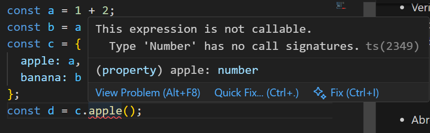

Preguntas de teoría

Modifica el código para conseguir que aparezca una línea roja de error en el
IDE avisándote de que se está disparando un TypeError . Toma una captura
de pantalla de tu resultado y haz que se muestre dentro del fichero
PEC2_E1_respuestas_teoria.md:

El error se produce porque la propiedad apple del objeto c contiene el número 3, y se intenta ejecutarlo como si fuera una función (c.apple()), lo que no tiene sentido en TypeScript.

Por tanto, TypeScript detecta este fallo en tiempo de compilación, mostrando un error  estático antes de que se ejecute el código. Si se lanza el programa recibiremos un error TypeError del interprete, en tiempo de ejecución.

Esto tiene varias ventajas. Por un lado, se previene fallos en tiempo de compilación, lo cual mejora la experiencia de desarrollo (el desarrollador recibe feedback inmediato). Además, la depuración es más sencilla, al ser este tipo de errores facilmente localizables gracias a el subrayado en rojo.

1. Para cada uno de los valores del fichero code2.ts, ¿Qué tipo de datos
inferirá TypeScript? Explica por qué se ha inferido este tipo de datos

a:
- Tipo Inferido: number
- Motivo: Es un literal numérico. Al utilizar const, se podría haber inferido el literal 1042, pero TypeScript por defecto promueve los números literales a number

b: 
- Tipo Inferido: string literal ('apples and oranges')
- Motivo: Las cadenas con const se infieren como literales exactos porque son inmutables en su valor.

c:
- Tipo inferido: string literal ('pineapple')
- Motivo: Igual que en b, es una cadena constante, TypeScript preserva el valor literal.

d:
- Tipo inferido: boolean[]
- Motivo: Una matriz homogénea de booleanos. TypeScript agrupa los elementos a su tipo base más genérico, boolean.

e:
- Tipo inferido: { type: 'ficus' }
- Motivo: Los objetos definidos con const mantienen los literales de sus propiedades.
No infiere string para type, sino el literal 'ficus'.

f:
- Tipo inferido: (number | boolean)[]
- Motivo: Es una matriz heterogénea, TypeScript toma la unión de tipos: number | boolean.

g:
- Tipo inferido: number[]
- Motivo: Aunque tenga un elemento, es un array y TypeScript lo trata como matriz homogénea de number.

h:
- Tipo inferido: null
- Motivo: Literal null → null.
Dependiendo del strictNullChecks, podría actuar como any, pero con configuración moderna es null.

2. ¿Por qué se dispara cada uno de los errores del fichero code3.ts?

(error a) 
const i: 3 = 3; i = 4;

Error: “Cannot assign to 'i' because it is a constant” y además “Type '4' is not assignable to type '3'”.

Explicación: i es const (no se puede reasignar) y su tipo literal es 3, por lo que cualquier valor distinto de 3 es incompatible.

(error b)
const j = [1, 2, 3];
j.push(4);     (ok)
j.push('5');   (mal)

Error: “Argument of type '"5"' is not assignable to parameter of type 'number'.”

Explicación: j se infiere como number[]. Empujar una cadena viola el tipo.

(error c)
let k: never = 4;

Error: “Type '4' is not assignable to type 'never'.”

Explicación: never es el tipo que no tiene valores (cosas que nunca ocurren: funciones que lanzan o no retornan). No se puede asignar ningún valor.

(error d)
let l: unknown = 4;
let m = l * 2; 

Error: “Object is of type 'unknown'.”

Por qué: unknown requiere refinamiento de tipo antes de usarlo. No puedes hacer operaciones aritméticas sin comprobar que es número.

3.

En TypeScript, una interfaz define la forma o estructura que debe tener un objeto, sirviendo como un formato que otras clases u objetos deben cumplir, pero sin incluir ninguna implementación y desapareciendo al compilar a JavaScript. Por otro lado una clase no solo define la estructura, sino también el comportamiento al incluir métodos, propiedades y otra lógica interna. 

Las clases existen en tiempo de ejecuión y se puede instanciar. Las interfaces solo se usan en tiempo de compilacion para asegurarnos de la consitencia de tipos.

